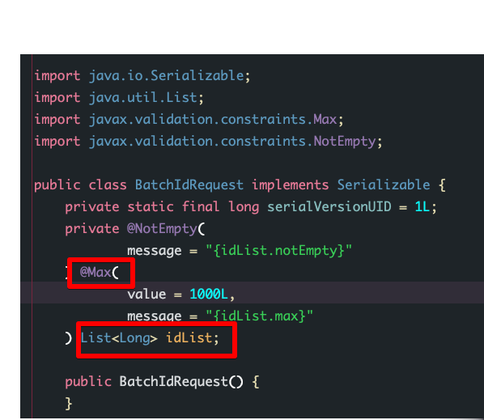
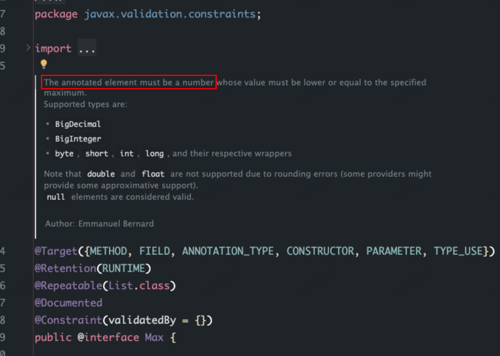

```bash
 HV000030: No validator could be found for constraint 'javax.validation.constraints.Max' validating type 'java.util.List<java.lang.Long>'. Check configuration for 'idList'
```

项目里看到的Controller 里的调用：

```java
    /*
     * 禁用
     */
    @PostMapping(value = "/disable")
    @ApiOperation("禁用")
    public ResultVo<Void> disable(@Validated @RequestBody BatchIdRequest request) {
        warehouseService.disable(request.getIdList());
        return ResultUtil.success(null);
    }
```

点进去看 jar包里封装的对 idList 参数的校验，看起来是想实现最大长度为 1000个元素的校验，but 实际上 @Max 这个注解是为了 Number 类型的数据而生的。源码注释如下：





若想要实现对数组长度的限制，应该使用 @Size 注解：

```java
@Data
public class BatchIdRequest {

    @NotEmpty(message = "{idList.notEmpty}")
    @Size(min = 1, max = 1000, message = "id list size must between 1 and 1000")
    private List<Long> idList;
}

```

当 controller 参数数组长度大于 1000 时，会返回校验的数据错误提示语：

```java
{
  "errno": 100,
  "errmsg": "id list size must between 1 and 1000;",
  "data": null,
  "logId": "088c58083b914f7893dcd30d2f3e31ee",
  "st": 1719221259928,
  "exception": null
}
```