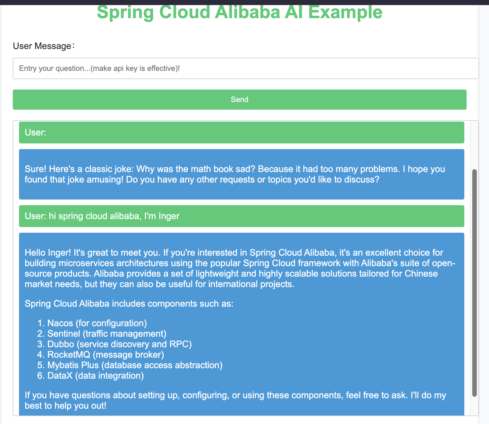

### 0. 背景

作为后端研发，在大模型背景下我们能做什么？基于这样的思考，展开探索。

### 1. Spring AI

进入官网依据指引安装好后，在官网 Readme 中发现如下内容：

> Create an account at [OpenAI Signup](https://platform.openai.com/signup) and generate the token at [API Keys](https://platform.openai.com/account/api-keys).
>
> The Spring AI project defines a configuration property named `spring.ai.openai.api-key` that you should set to the value of the `API Key` obtained from `openai.com`.

在 openai 宣布全面封锁中国ip的情况下，卒，转头考虑阿里巴巴推出的 Spring AI Alibaba。

### 2. Spring AI Alibaba

在 Spring AI 基础上提供阿里云通义系列大模型全面适配。

申请灵积模型 API Key，下载源码。

代码改改，打完收工，今天又认识了一个新朋友 Spring AI Alibaba!



上图为通过静态页面对话，其他接口：

- /ai/audio/speech：文本生成.wav 语音文件
- /ai/audio/transcription: 实时语音识别
- /ai/example：对话（tell me a joke）
- /ai/stream: 批量文本（请告诉我西红柿牛腩怎么做？）生成内容看起来并不是很能用，有待提高
- /ai/output: 输出演员的电影
- /ai/prompt-tmpl: prompt 优化后产生的结果
- /ai/stuff: 问答
- /ai/roles：问答
- /ai/img: prompt 生成图像，结果容易报错

```bash
2024-06-28T00:02:29.007+08:00  WARN 9378 --- [tongyi-example] [nio-8396-exec-5] .w.s.m.s.DefaultHandlerExceptionResolver : Resolved [org.springframework.web.context.request.async.AsyncRequestNotUsableException: ServletOutputStream failed to write: java.io.IOException: Broken pipe]
```


---
Reference:

1. [安装 Spring 命令行工具](https://docs.spring.io/spring-cli/reference/installation.html)
2. [Spring AI Get Start](https://spring.io/projects/spring-ai#overview)
3. [Spring AI Alibaba Overview](https://sca.aliyun.com/docs/2023/user-guide/ai/overview/?spm=5176.29160081.0.0.74801a15dakekm)
4. [阿里灵积模型服务](https://help.aliyun.com/zh/dashscope/developer-reference/activate-dashscope-and-create-an-api-key)
5. [Spring Cloud Alibaba AI Example](https://github.com/alibaba/spring-cloud-alibaba/tree/2023.x/spring-cloud-alibaba-examples/ai-example/spring-cloud-ai-example)
